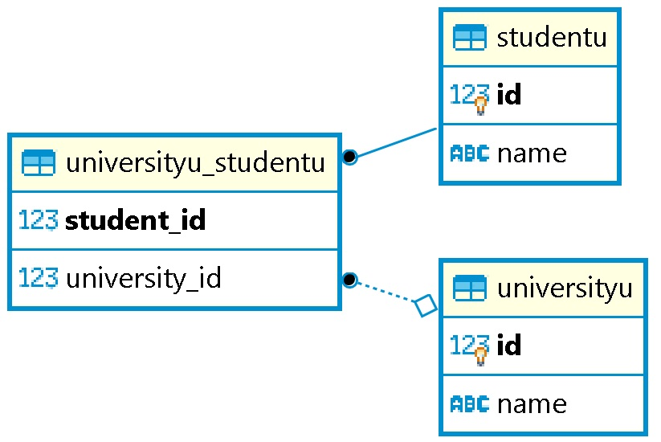

# spring-rabbitmq demo

This project is demos for JPA relations:

* @OneToOne
* @OneToMany
* @ManyToOne
* @ManyToMany

## Prerequisites 🔨

1. Install Windows 10 or Linux
2. Install java version 11.0.x (suggested: 11.0.10)

## Installation 🔧

### Postgress SQL with docker
1. Dowload the image:
``` docker pull postgres:10 ```
2. Start container with:
``` docker run -d --name postgresdb -e POSTGRES_PASSWORD=postgres -p 5432:5432 postgres:10 ```
3. Enter docker bash
``` docker exec -it postgresdb bash ```
4. Enter PostgreSql shell
``` psql -U postgres ```
5. create db
``` CREATE DATABASE bootcamp; ```
6. Exit PostgreSql shell:
``` Type \q and then press ENTER to quit psql. ```
7. Exit docker shell:
``` Type exit ```
8. Credentials:
```
host: localhost/ip
port: 5432
default dbname: postgres
default user: postgres
password: postgres
```
9. create the data base: ``` CREATE DATABASE relation; ```

## Deploy 🚀

1. config: ```application.properties```
2. build with: ```gradlew build```
3. start with: ```gradlew bootRun```

## Diagrams 🎨

### One to One

<p align="center">
  
</p>

### One to Many: Unidirectional

<p align="center">
  
</p>

### One to Many: Unidirectional with Join table

<p align="center">
  
</p>

### One to Many - Many to one: Bidirectional

<p align="center">
  
</p>

### Many to Many

<p align="center">
  
</p>


## Usage 🎮

### EndPoints


