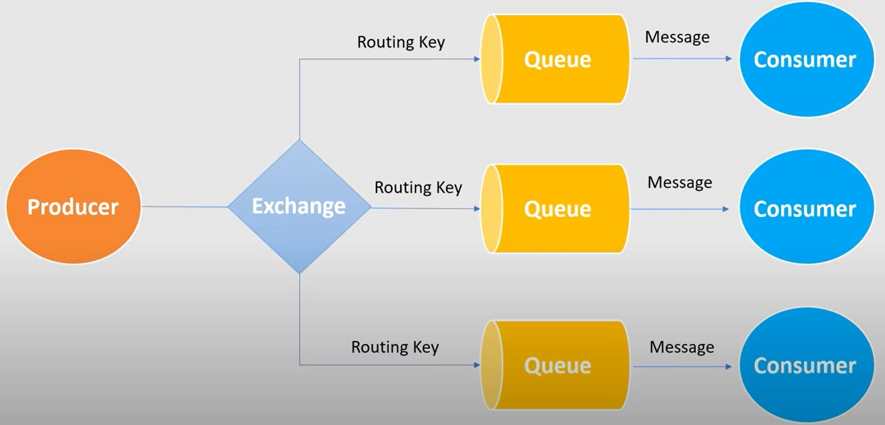
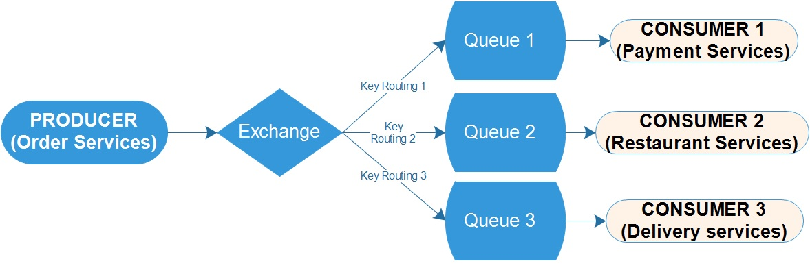

# spring-rabbitmq demo

This project is using fanout exchange.

## Prerequisites 🔨

1. Install Windows 10 or Linux
2. Install java version 11.0.x (suggested: 11.0.10)

## Installation 🔧

### Installation RabbitMQ in docker.
1.	Find the next path: ```RabbitMQ Server\rabbitmq_server-3.8.14\sbin```
2.	Execute the command: ```rabbitmq-plugins.bat enable rabbitmq_management```
3.	Open the browser and write the URL: http://localhost:15672/
4.	Log in as user ‘guest’ and password ‘guest’

### Installation RabbitMQ Normal.
1. Download and install ERlang ```http://erlang.org/download/otp_win64_22.3.exe```
2. Downlaod and install RabbitMQ.
3. Go to RabbitMQ Server install Directory C:\Program Files\RabbitMQ Server\rabbitmq_server-3.8.3\sbin
4. Run command rabbitmq-plugins enable rabbitmq_management.
5. Open browser and enter http://localhost:15672/ to redirect to RabbitMQ Dashboard.
6. Also we can Open it with IP Address http://127.0.0.1:15672.
7. Login page default username and password is guest.
8. After successfully login you should see RabbitMQ Home page.


## Deploy 🚀

1. Start Order producer services: enter to  ```producer-services-order``` folder and execute ```gradlew bootRun```
2. Start payment consumer services: enter to  ```consumer-services-payment``` folder and execute ```gradlew bootRun```
3. Start restaurant consumer services: enter to  ```consumer-services-restaurant``` folder and execute ```gradlew bootRun```
4. Start delivery consumer services: enter to  ```consumer-services-delivery``` folder and execute ```gradlew bootRun```

## Diagrams 🎨

### RabbitMQ generic diagram

<p align="center">
  
</p>

### RabbitMQ configuration

<p align="center">
  
</p>


## Usage 🎮

### EndPoints

1. in order publish order you need to do post request:
2. Endpoint: ``` http://localhost:8081/order ```
3. Body
```
{
  "footName": "Amburguesa doble con queso",
  "deliveryAddress": "Av. Blanco Galindo km 3, N547",
  "quantity": 1,
  "price": 50.5
}
```
